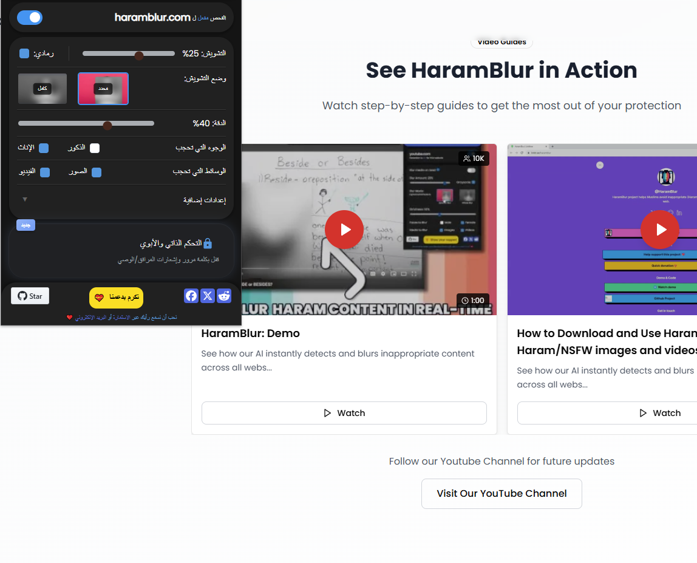

# إضافة HaramBlur

HaramBlur 
هي إضافة للمتصفح تتيح لك تصفح الإنترنت بما يتوافق مع قيمًنا الإسلامية، مع الحفاظ على خصوصيتك وعدم رؤية الصور أو الفيديوهات الغير لائقة 


تعتمد HaramBlur
 على تقنيات كشف الوجوه واكتشاف المحتوى الغير لائق وتوفر أدوات تحكم على غضّ البصر وتخصيص تجربتك على الإنترنت عبر تشويش / تعتيم  الصور ومقاطع الفيديو التي تحتوي على محتوى غير مرغوب فيه أو غير مسموح به.

يمكنك من خلال مشروعنا وضعية تشويش التي تحتاجها والمستوى الي يشوش على صورة بشكل كامل، كما يمكنك تمرير المؤشر لإلغاء تشويش، أو اختيار جنس محدد، أو تشغيل/إيقاف الإضافة من خلال النافذة التفاعلية  كما موضح لكم في الصورة :

##  المميزات

- يعمل على الصور ومقاطع الفيديو التي تحتوي على محتوى غير مرغوب فيه أو غير مسموح به.

- تعمل الإضافة على معظم المواقع (إن لم يكن جميعها) ومنصات التواصل الاجتماعي.

- إعدادات مستوى  قابلة للتخصيص لتناسب تجربتك في التصفح.

- نافذة تفاعلية لتشغيل/إيقاف الإضافة بسهولة.

- إمكانية تخصيص ميزة إلغاء تشويش عند تمرير المؤشر.

- سرعة ودقة جيدة (تتحسن باستمرار).

##  طريقة عمل الإضافة

يستخدم 
HaramBlur
 حاليًا ميزات كشف الوجوه والتعرف عليها التي توفرها مكتبة [Human library](https://github.com/vladmandic/human) لتمييز الوجوه وتشويشها وفقًا لإعدادات وتفضيلات المستخدم. كما يعتمد أيضًا على تقنية كشف المحتوى غير اللائق [nsfwjs](https://github.com/infinitered/nsfwjs/) لتحسين مستوى الدقة بشكل أكبر.

يمكنك ضبط نوع الكشف الذي تريده ودرجة تشويش، وتفعيل خيار إلغاء تشويش عند تمرير المؤشر، أو تشغيل/إيقاف الإضافة عبر النافذة التفاعلية 

##  إرشادات التثبيت
الخيار الأول: استخدام الإضافة من متجر الإضافات

قم بزيارة موقعنا
 HaramBlur 
واختر متصفحك
الإداة متوفرة على  جوجل كروم / فايرفوكس
[Haramblur extension on the Chrome Web Store](https://chrome.google.com/webstore/detail/haramblur/pbcoegikffnadpahojjhgdladmmddeji) or the [Firefox Add-ons Store](https://addons.mozilla.org/addon/haramblur/)
اتبع خطوات التثبيت الموجودة في الصفحة.

## - الخيار الثاني: 
تشغيل الإضافة بنفسك

إذا كنت ترغب في تشغيل الإضافة بنفسك، اتبع الخطوات التالية:

### الخطوة 1: استنساخ المستودع

استنسخ مستودع HaramBlur إلى جهازك المحلي:

###  كروم 

```bash
git clone https://github.com/alganzory/HaramBlur.git
```


### فايرفوكس

```bash
git clone -b firefox-main --single-branch https://github.com/alganzory/HaramBlur.git
```
### الخطوة 2: تثبيت الاعتمادات

انتقل إلى مجلد المشروع وقم بتثبيت الاعتمادات اللازمة:

```bash
npm install
```

### الخطوة 3: أضف تعديلاتك البرمجية

قم بإجراء التعديلات أو التحسينات التي تراها مناسبة على الكود.

### الخطوة 4: تشغيل الإضافة

- قم بتشغيل الإضافة بتنفيذ الأمر:

    ```bash
    npm run build
    ```

### الخطوة 5: إنشاء ملف إصدار (اختياري)

قم بإنشاء ملف مضغوط (zip) يمكن رفعه إلى المتصفح/الإضافة عبر الأمر:
```bash
npm run release
```

### تحميل الإضافة على متصفحات كروم

انتقل إلى:

 -  `chrome://extensions/`.
 -  فعّل وضع المطور "Developer mode".
 -  اضغط على Load unpacked واختر مجلد المشروع.

- تحميل الإضافة على فايرفوكس

انتقل إلى:

-  `about:addons`

-  اضغط على أيقونة ثلاث نقاط الموجودة

-  بتختار Install Add-on from file.

- حدد الملف الـمضغوط الذي أنشأته في الخطوة الخامسة.

### تحسينات قادمة 🚀

بعض التحسينات المخطط تنفيذها على HaramBlur:

- دعم المزيد من المتصفحات.

- تحسين سرعة  تشويش على صور / الفيديوهات الغير لائقة

- رفع الدقة لكشف المحتوى الغير مناسب (لتقليل النتائج الخاطئة).

- جعل الإضافة أكثر توافقًا مع الشريعة بإضافة خيارات حسب ماتريد  وتخصيصات إضافية.

## مشروع مفتوح المصدر 💻

HaramBlur 
مشروع مفتوح المصدر، ونرحب بأي مساهمات
يمكنك فتح issue أو إرسال pull request إذا كان لديك اقتراحات أو تحسينات.

## هل أعجبك المشروع؟ 🌟

إذا أعجبك المشروع، ضع له نجمة ⭐️ على GitHub.

وإن أردت دعمي أكثر، يمكنك مساهمة من خلال هذا رابط ☕️.
[buy me a coffee ☕️](https://www.buymeacoffee.com/alganzory)
سائلين الله عز وجل ان يبارك في هذا المشروع وجزاكم الله خيراً،

لاتنسونا من صالح دعائكم 🤲
